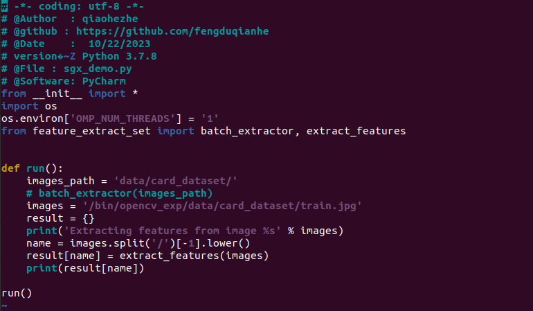

## Privacy Preserving Image Feature Extraction in TEE

- [Privacy Preserving Image Feature Extraction in TEE](#privacy-preserving-image-feature-extraction-in-tee)
  - [00、Introduction](#00introduction)
  - [01、Install Intel SGX](#01install-intel-sgx)
  - [02、Install Occlum](#02install-occlum)
  - [03、Run Python in Occlum](#03run-python-in-occlum)
  - [04、Run the Image Feature Extraction Algorithm](#04run-the-image-feature-extraction-algorithm)

### 00、Introduction 

This document provides guidance on configuring Intel SGX to run a **Python-based feature extraction algorithm**. We leverage the libOS Occlum to execute an unmodified Python program. We use a server with 64-bit Ubuntu 20.04 LTS operating system, Intel(R) Core(TM) i7-9750H CPU with 12 physical cores. We provides step-to-step guideline as follows. 


### 01、Install Intel SGX

-----

Intel(R) Software Guard Extensions (Intel(R) SGX) is an Intel technology for application developers seeking to protect secret code and data from disclosure or modification. Refer to https://github.com/intel/linux-sgx for more details.

**Prerequisites**

1. Check whether your machine support Intel SGX (you can also run the attached project: check_sgx.c);

    

   PS: As shown in the figure, sgx 1 supported: 1 indicates support, while 0 indicates lack of support.

2. OS: Ubuntu 18.04 LTS, Ubuntu 20.04 LTS, or Ubuntu 22.04 LTS;

**Installation**

1. find the attachments install_deps.sh and install_sgx_driver.sh;
2. install the dependencies and Intel SGX SDK;

```bash
sudo ./install_deps.sh
```
PS: The command `source /opt/intel/sgxsdk/environment` represents the SGX source path. To automate its execution every time the terminal starts, consider adding this command to the ~/.bashrc file.

3. install the Intel SGX Driver

```bash
sudo ./install_sgx_driver.sh
```

4. startup the Intel SGX services

```bash
sudo /opt/intel/sgx-aesm-service/startup.sh	
```

If any issues arise during the installation process, you can refer to https://github.com/intel/linux-sgx for guidance.

5. test the installation

+ compile the code (refer to the attached project: simple_exp)

```bash
make  # hardware mode
make SGX_MODE=SIM  # simulation mode
```


+ run the binary

```bash
./app
```

 


### 02、Install Occlum

------

1. Quick Start with Docker

Many Occlum versions are available on Docker Hub, making it convenient to pull images directly. Pull the image and start the container using following command.

```bash
docker pull occlum/occlum:0.30.0-ubuntu20.04
docker run --privileged -it --name=occlumdemo --device /dev/sgx/enclave occlum/occlum:0.30.0-ubuntu20.04 bash
```

**Parameters**

+ --privileged: increase privileges.
+ --name: specify the container name.
+ --device: specify mapping the host's /dev/sgx/enclave device to the container's /dev/sgx/enclave device for running SGX-dependent applications inside the container.

Success as shown in the figure.


If it reports following errors, it means that the BIOS has not enabled SGX. You should check whether your machine supports Intel SGX. If yes, you can enable Intel SGX via the "software enable" procedure quickly. Please refer to https://github.com/intel/sgx-software-enable for more details.


2. Install with Official Specification

```bash
echo 'deb [arch=amd64] https://occlum.io/occlum-package-repos/debian focal main' | tee /etc/apt/sources.list.d/occlum.list
wget -qO - https://occlum.io/occlum-package-repos/debian/public.key | apt-key add -
apt-get update
apt-get install -y occlum
echo "source /etc/profile" >> $HOME/.bashrc
```

Refer to https://github.com/occlum/occlum/blob/master/docs/install_occlum_packages.md for more details.


3. Test the installation

+ **step-0 :** download the file hello_word.c

```bash
wget https://raw.githubusercontent.com/occlum/occlum/master/demos/hello_c/hello_world.c
```

+ **step-1 :** compile the user program using the Occlum toolchain (e.g., occlum-gcc).

```bash
occlum-gcc -o hello_world hello_world.c
```

This will result in an executable file. You can test if it compiled successfully by running ./hello_world, which should output "Hello World."

 

+ **step-2 :** initialize an Occlum instance

```bash
mkdir occlum-instance && cd occlum-instance && occlum init
occlum new occlum-instance # alternatively
```

 

+ **step-3 :** copy the compiled file (executable hello_world) into the occlum-instance/image/bin/ folder

```bash
cp ../hello_world image/bin
```

+ **step-4 :** build the Occlum instance

```bash
occlum build  # hardware mode
occlum build --sgx-mode SIM  # simulation mode
```

 

+ **step-5 :** run the Occlum instance


```bash
occlum run /bin/hello_world
```

 


### 03、Run Python in Occlum 

------

In the occlum/demos directory, there are many examples provided by the official documentation, including but not limited to C++, Java, Python, etc. Here, we take Python as an example.


1. install miniconda with the following script


```bash
#!/bin/bash
set -e
script_dir="$( cd "$( dirname "${BASH_SOURCE[0]}"  )" >/dev/null 2>&1 && pwd )"


# Install python and dependencies to specified position
[ -f Miniconda3-latest-Linux-x86_64.sh ] || wget https://repo.anaconda.com/miniconda/Miniconda3-latest-Linux-x86_64.sh
[ -d miniconda ] || bash ./Miniconda3-latest-Linux-x86_64.sh -b -p /root/miniconda

echo "source /root/miniconda/etc/profile.d/conda.sh" >> ~/.bashrc
source ~/.bashrc
```

If the download speed is extremely slow, consider trying a different mirror using the command conda config --add channels.

```bash
conda config --add channels http://mirrors.tuna.tsinghua.edu.cn/anaconda/pkgs/free/
conda config --add channels http://mirrors.tuna.tsinghua.edu.cn/anaconda/cloud/conda-forge 
conda config --add channels http://mirrors.tuna.tsinghua.edu.cn/anaconda/cloud/msys2/
conda config --add channels http://mirrors.tuna.tsinghua.edu.cn/anaconda/cloud/pytorch/
conda config --add channels fastai
conda config --set show_channel_urls yes
```

2. occlum init、build、run

Using the attached project, i.e., np, as an example.

**directory struct in an occlum project**
- np.yaml：YAML file specifying the directory structure to be copied into Occlum images.
- init.sh：script for creating a Python environment using conda (run only once if dependencies don't change).
- build.sh：script for initializing the Occlum instance and generating Occlum images.
- run.sh：script for initializing the Occlum instance and generating Occlum images.
- code：source code directory (modify if there are relative paths; adjust based on the Occlum images' paths).

 

+ **step-1 :** modify the .yaml file (shown in the following red box), that indicates copying the `../code` directory to `/bin` (relative to path `occlum_instance/images`).


+ **step-2 :** run the script init.sh

```
./init.sh
```

 

+ **step-3 :** run the script build.sh

```
./build.sh
```

 

+ **step-4 :** run the script run.sh

```
./run.sh
```

 


### 04、Run the Image Feature Extraction Algorithm

------

Using the attached project, i.e., sgx_demo. Note that sgx_demo is an simple demo for image feature extraction, which uses the library openCV. The steps are similar to the above.

+ **step-1 :**  modify the source code to limit thread count and change the relative path of the image.

 

+ **step-2 :**  write the scripts for openCV


```yaml
includes:
  - base.yaml
targets:
  - target: /bin
    createlinks:
      - src: /opt/python-occlum/bin/python3
        linkname: python3
  # python packages
  - target: /opt
    copy:
      - dirs:
          - ../python-occlum
  # below are python code and data,you also can cp this demo.py to image/bin/ by hand before occlum build
  - target: /bin
    copy:
      - dirs:
         - ../opencv_exp
```

+ **step-3 :** update the init.sh (refer to the attached `project sgx_demo/init.sh`) and run the script

```bash
#!/bin/bash
set -e
script_dir="$( cd "$( dirname "${BASH_SOURCE[0]}"  )" >/dev/null 2>&1 && pwd )"

#  Install python and dependencies to specified position
/root/miniconda/bin/conda create --prefix $script_dir/python-occlum -y python=3.7.8 matplotlib imageio numpy opencv-python-headless scipy
```

```
./init.sh
```


+ **step-4 :** update the build.sh (refer to the attached `project sgx_demo/build.sh`) and run the script

```
./build.sh
```

+ **step-4 :** update the run.sh (refer to the attached project `sgx_demo/run.sh`) and run the script

```
./run.sh
```

 
